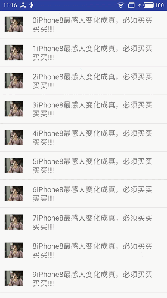

# ViewFlipper
基于android的，上下轮播显示消息的控件，android自带的ViewFliper不支持特别多的消息需要轮播，特别是在列表中，会显著卡顿。重新实现了上下轮播功能。尚未支持动画效果拓展，后续提供接口支持，或者自行修改源码。

### demo


<br/>

### 用法
```
自行扩展BaseFlipperAdaper，可以自定义控件
    /**
     * 实现适配器
     * */
    private class FlipperAdapter extends BaseFlipperAdapter{
        private List<String> mData;

        public void setData(List<String> data){
            mData = data;
        }

        @Override
        public int getCount() {
            return mData == null ? 0 : mData.size();
        }

        @Override
        public View getView(View convertView, int position) {
            if(convertView == null){
                convertView = View.inflate(DemoActivity.this, R.layout.layout_flipper_item, null);
            }

            TextView textView = (TextView) convertView;
            textView.setText(mData.get(position));

            return convertView;
        }
    }
 
```
```
然后设置adapter
            TextViewFlipper textViewFlipper = (TextViewFlipper)convertView.findViewById(R.id.text_view_flipper);
            FlipperAdapter adapter = (FlipperAdapter)textViewFlipper.getAdapter();
            if(adapter == null){
                adapter = new FlipperAdapter();
            }
            adapter.setData(mockDatas.get(position));
            textViewFlipper.setFlipperAdapter(adapter);
            textViewFlipper.startFlipping();
```

# About
@Author : Liu Liaopu </br>
@Website : https://github.com/newhope1106

# License
Copyright 2016-2017 Liu Liaopu

Licensed under the Apache License, Version 2.0 (the "License"); you may not use this file except in compliance with the License. You may obtain a copy of the License at

http://www.apache.org/licenses/LICENSE-2.0

Unless required by applicable law or agreed to in writing, software distributed under the License is distributed on an "AS IS" BASIS, WITHOUT WARRANTIES OR CONDITIONS OF ANY KIND, either express or implied. See the License for the specific language governing permissions and limitations under the License.   